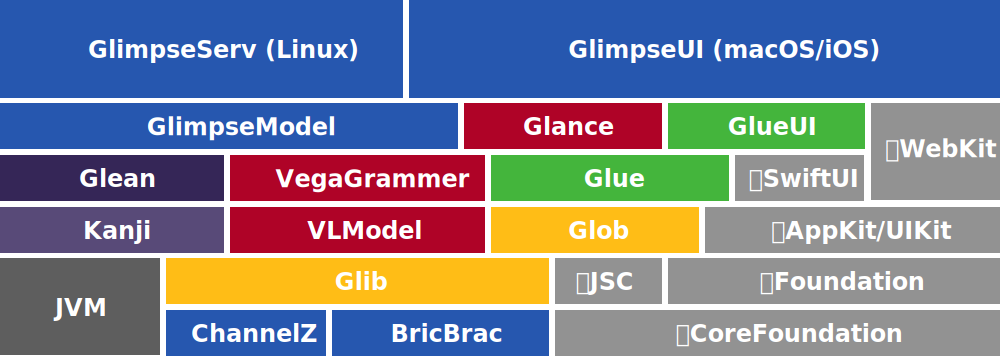

## Requirements

Xcode 12.2+ on macOS 11

## Clone repository & submodules

```bash
$ git clone -j8 --recurse-submodules --remote-submodules https://github.com/glimpseio/GIO.git
$ cd GIO/
```
 
## Refresh `HEAD`

```bash
$ git pull --recurse-submodules -j8
```


## Running Glimpse.app

Open `GIO.xcworkspace` in Xcode and run the `Glimpse`/`My Mac` target for the `GUI` workspace.
  
  
## Run tests

All the test can be run from Xcode, or using the following command:

```bash
$ xcodebuild -scheme Glimpse test
```

Note that this will run all the tests in all the dependent modules as well. which usually takes between 1-2 hours. Tests can also be run in the indiviudal modules for speedier and more focused unit testing.

## Repository organization

The Glimpse project is divided into a number of different workspaces, each which contains one more more module and unit tests and is managed in its own separate repository. This modularity provides separation of concerns and help build performance. In addition, maintaining separate repo

A high-level overview of the modules is as follows:



### [BricBrac](https://github.com/glimpseio/BricBrac)
Data structures and utilities for `Codable` models. ~15k SLOC.
 * [BricBrac/BricBrac](https://github.com/glimpseio/BricBrac/tree/main/Sources/BricBrac): Provides JSON utilities and structures for `Codable` support, such as a `Bric` enum representing JSON data types and a `OneOf2` *"Either"* type.
 * [BricBrac/Curio](https://github.com/glimpseio/BricBrac/tree/main/Sources/Curio): Swift `struct` code-generator for [JSON Schema](http://json-schema.org) definitions.
 
 ### [Glib](https://github.com/glimpseio/Glib)
 Common shared utilities for parsing, logging, platform interaction, etc. ~22k SLOC.
 * [Glib/Glib](https://github.com/glimpseio/Glib/tree/master/Glib): Utilities that have no dependencies outside of `Foundation`.
 * [Glib/Glob](https://github.com/glimpseio/Glib/tree/master/Glob): Utilities with dependencies (such as `CoreGraphics` and `JavaScriptCore`)
 
 ### [Glean](https://github.com/glimpseio/Glean)
 Spreadsheet & flat-file parsing & database connections for importing, exporting, and processing data. ~5k SLOC.
 * [Glean/GleanModel](https://github.com/glimpseio/Glean/tree/master/Glean): Drivers for connecting to various data sources.
 * [Glean/Glean](https://github.com/glimpseio/Glean/tree/master/GleanModel): Dependency-free data representation `Glean` definitions.

### [Glue](https://github.com/glimpseio/Glue)
General-purpose GUI widgets & utilities. ~21k SLOC.
* [Glue/Glue](https://github.com/glimpseio/Glue/tree/master/Glue): AppKit & UIKit components.
* [Glue/GlueUI](https://github.com/glimpseio/Glue/tree/master/GlueUI): SwiftUI components.

### [Glance](https://github.com/glimpseio/Glance)
Data visualization using the [Vega-Lite](https://vega.github.io) grammer. ~38k SLOC.
 * [Glance/VLModel](https://github.com/glimpseio/Glance/tree/master/VLModel): `Curio`-generated struct representing the [vega-lite](https://vega.github.io/vega-lite/docs/spec.html) visualization specification from [vega-lite-schema.json](https://github.com/glimpseio/Glance/blob/master/Glance/Resources/js/vega-lite-schema.json).
 * [Glance/VegaGrammar](https://github.com/glimpseio/Glance/tree/master/VegaGrammar): Semantic layer atop `VLModel` that provides additional ergonomics and utilities, and eases the process of performing schema upgrades.
 * [Glance/Glance](https://github.com/glimpseio/Glance/tree/master/Glance): Renders `VLModel` in an embedded browser or headlessly to various output formats: SVG, PNG, PDF, & HTML.
 
 ### [GUI](https://github.com/glimpseio/GUI)
 The Glimpse application. ~27k SLOC.
 * [GUI/GlimpseModel](https://github.com/glimpseio/GUI/tree/master/GlimpseModel): The data model for a `.glimpse` document, which is stored as a compressed JSON representation of a `Glance.VizSpec`
 * [GUI/GlimpseUI](https://github.com/glimpseio/GUI/tree/master/GlimpseUI): The core of the Glimpse UI implemented as SwiftUI components.
 * [GUI/Glimpse](https://github.com/glimpseio/GUI/tree/master/Glimpse): The `NSApplication` entry point to Glimpse.app, containing the `NSDocument` implementation of `GlimpseModel` the the `NSWindowController` that manages the application lifecycle and hosts the `GlimpseUI` components.
 * [GUI/GlimpseApp](https://github.com/glimpseio/GUI/tree/master/GlimpseApp): Prototype of iOS version of Glimpse.
 * [GUI/GlimpseServ](https://github.com/glimpseio/GUI/tree/master/GlimpseServ): Prototype of Linux Glimpse collaboration server.

## Conceptual Overview

### Basic Architecture

#### ViewModelState & SwiftUI

Glimpse follows a custom variant of the [Model–view–viewmodel (MVVM)](https://en.wikipedia.org/wiki/Model–view–viewmodel) design pattern. Most of the "business logic" of a `.glimpse` document is implement in the `GlimpseModel` framework, which defines a `GlimpseViewModelState` protocol whose only requirement is that it expose `store` and `state` properties. Most high-level actions performed by the Glimpse GUI will be implementes as extensions to the `GlimpseViewModelState` protocol. 

The `ViewModelState` is a struct that implements the `GlimpseViewModelState` protocol, and is a "pure" value type (in that it contains references *only* to other value types). As such, it provides automatic conformance to `Equatable` and `Hashable`. The `ViewModel`'s model is a `store` property of type `GlimpseSpec`, which contains everything that will be serialized to a `.glimpse` file (which simply consists of the compressed JSON output of `GlimpseSpec`'s `Codable` support). The store's lifecycle is managed by the Cocoa `AppKit.NSDocument` system when a `.glimpse` file is loaded by the user, as described at [Developing a Document-Based App](https://developer.apple.com/documentation/appkit/documents_data_and_pasteboard/developing_a_document-based_app). 

In addition to the `store` model, `ViewModel` also contains a `state` of type `ViewState`, which contains the current state of the user-interface as pertains to the model. This includes things like the "current selection" and the list of expanded inspectors. The `ViewState` is `Codable`, but it is not stored in the `.glimpse` file with the `GlimpseSpec`: rather, it is automatically serialized and stores in the user's per-document settings by the Cocoa [State Restoration](https://developer.apple.com/documentation/uikit/uiviewcontroller/1621461-encoderestorablestatewithcoder) process. If there are deserialization errors in the state then it is transparently thrown away by the document loading system and a fresh one is used, as per the following [note on state encoding](https://developer.apple.com/documentation/uikit/uiviewcontroller/1621461-encoderestorablestatewithcoder): 

> You should consider any data you write to the coder as purgeable and be prepared for it to be unavailable during subsequent launches.


The logic in the `GlimpseModel.ViewModelState` is all "headless", in that while it defines various properties that *could* be implemented by a graphical user interface (such as a "selection"), the operations that are performed on the model do not require any sort of interface. This makes much of the UI logic testable in `GlimpseModelTests` in a context-free environment.

The graphical user interface of Glimpse is implemented in the `GlimpseUI` framework. One common feature of nearly every `SwiftUI.View` implementation that interacts with the model is that they all contain a `GlimpseContext`, which provides access to the `ViewModelState` via the `vms` property:

```swift
struct LayerTitleEditingView : View {
    @EnvironmentObject var ctx: GlimpseContext
    
    var body: some View {
        TextField("Layer Title", value: $ctx.vms.selectedLayer.title)
    }
}
```

The `ViewModelState` and the `GlimpseContext` both conform to `GlimpseViewModelState`, which is a protocol that contains metely the `store` and `state` properties

Because the `ViewModelState` is a tree of value types, undo and redo are supported by simply storing the current `ViewModelState` in the undo stack whenever a change is made. This is all handled automatically by the `GlimpseContext` in its `store`'s `willSet` property. An undo event is only triggered by changes to the `store` (since changes to the `state` like changing the current selected outline row or visible inspector tab shouldn't themselves be recorded as an undo-able event), but note that the *entire* `ViewModelState` is saved to the undo stack. This is so that when the action is un-done or re-done, the user interface state in the `ViewState` will be restored to its appearance at the time the `store` change occurred.

In addition to the `ViewState`, some non-restorable and non-undoable state is stored in a `TransientViewState`, which is accessed in `GlimpseContext.tmp`. This structure contains shared user-interface properties that are explicitly *not* meant to be restorable, such as the currently focused items and whether the canvas and data grid are visible. To determine whether a new user interface property should be added to `ViewState` or `TransientViewState`, consider whether it makes sense to that user-interface feature should be part of the undo/redo process or not. 

Properties can be moved between the two structures between versions, so it generally makes sense to first add new properties to `TransientViewState` and then, if it makes sense, move them into `ViewState` later. Note that making incompatible changes to the `ViewState` will simply cause the document loaded system to purge the old serialized version and start with a fresh new state: the only indication that the user has of this happening is that previously-opened documents may not have their user interface restored to the exact state that it was previously. This is in contrast to the properties in the `store`: making incompatible changes to the `GlimpseSpec` structure would result in earlier versions of `.glimpse` files being unreadable to future versions of Glimpse. Data in `GlimpseSpec` that needs to be migrated from previous versions should be fixed up in the `GlimpseSpec.migrate()` function.


